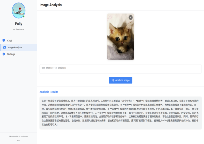

# Personalized Multimodal AI Digital Assistant

This project demonstrates a personalized multimodal AI assistant with profile-driven behavior, capable of text chat, image analysis, and image generation.

## 🎬 Demo Screenshots

### Text Chat Interface
Experience natural conversations with the AI assistant powered by GPT-4o.

<p align="center">
  
</p>

### Image Generation
Create stunning images from text descriptions using DALL-E 3.

<p align="center">
  
</p>

### Image Understanding
Analyze and understand images with advanced vision AI capabilities.

<p align="center">
  
</p>

---

## Features

- **Profile-Driven Personalization**: The assistant's behavior is driven by a personality profile that defines traits like openness, conscientiousness, extraversion, agreeableness, and emotional stability.
- **Multimodal Interaction**: Supports text chat, image analysis, and image generation.
- **Text Chat**: Interactive conversations with the AI assistant powered by GPT-4o.
- **Image Analysis**: Upload and analyze images using computer vision models.
- **Image Generation**: Create unique images from text descriptions using DALL-E 3.
- **Responsive UI**: Modern, responsive interface with light/dark theme support.
- **Real-time Communication**: Uses REST APIs for seamless communication with the backend.
- **Profile Customization**: Easily customize the AI's personality through JSON configuration.

## 🎯 Use Cases

- **Personal AI Assistant**: Daily task management and information queries
- **Creative Projects**: Generate artwork and analyze visual content
- **Learning Tool**: Interactive educational conversations
- **Content Creation**: Brainstorming and creative writing assistance
- **Image Analysis**: Understanding visual content and extracting information

## Project Structure

```
demo/
├── models/                    # Profile model and default profile
│   ├── profile_model.py       # Profile model implementation
│   └── default_profile.json   # Default personality profile
├── static/                    # Static assets
│   ├── css/                   # CSS styles
│   ├── js/                    # JavaScript files
│   └── images/                # Images and avatars
├── templates/                 # HTML templates
│   └── index.html             # Main application template
├── app.py                     # FastAPI application
├── requirements.txt           # Project dependencies
├── .env.example              # Environment variables template
├── .gitignore                # Git ignore rules
├── setup.sh                  # Setup script (Unix/Linux/Mac)
├── start.sh                  # Quick start script (Unix/Linux/Mac)
├── CONFIG.md                 # Configuration guide
├── DEPLOYMENT.md             # Deployment guide
├── CONTRIBUTING.md           # Contribution guidelines
├── LICENSE                   # MIT License
├── Dockerfile                # Docker configuration
└── docker-compose.yml        # Docker Compose configuration
```

## Technical Architecture

1. **Frontend**: HTML/CSS/JavaScript for the user interface
2. **Backend**: FastAPI for the server
3. **Multimodal Core**: Integration with large language models (LLMs) for text processing, computer vision for image analysis, and DALL-E for image generation
4. **Personalization Engine**: Profile-driven personality model

## Quick Start

### Prerequisites
- Python 3.8 or higher
- Azure OpenAI API access

### Installation

1. **Clone the repository**
   ```bash
   git clone https://github.com/Polly2014/AI_School_2025_Playground.git
   cd AI_School_2025_Playground/demo
   ```

2. **Set up the environment**
   ```bash
   # Use the setup script for easy installation
   chmod +x setup.sh
   ./setup.sh
   ```
   
   Or manually:
   ```bash
   # Create virtual environment
   python -m venv venv
   source venv/bin/activate  # On Windows: venv\Scripts\activate
   
   # Install dependencies
   pip install -r requirements.txt
   
   # Copy environment template
   cp .env.example .env
   ```

3. **Configure your API keys**
   
   Edit `.env` file and add your Azure OpenAI credentials:
   ```env
   LLM_API_KEY=your_azure_openai_api_key_here
   LLM_API_ENDPOINT=https://your-resource.openai.azure.com/openai/deployments/your-model/chat/completions?api-version=2025-01-01-preview
   
   # For image generation (DALL-E)
   DALLE_ENDPOINT=https://your-resource.openai.azure.com/
   DALLE_DEPLOYMENT=dall-e-3
   DALLE_API_KEY=your_azure_openai_api_key_here
   ```

4. **Start the application**
   ```bash
   # Quick start
   ./start.sh
   
   # Or manually
   python app.py
   ```

5. **Open your browser**
   Navigate to `http://localhost:8000`

## Environment Variables Reference

### Required Variables

| Variable | Description | Example |
|----------|-------------|---------|
| `LLM_API_KEY` | Azure OpenAI API key | `your_api_key_here` |
| `LLM_API_ENDPOINT` | Azure OpenAI endpoint URL | `https://your-resource.openai.azure.com/...` |

### Image Generation Variables

| Variable | Description | Default | Example |
|----------|-------------|---------|---------|
| `DALLE_ENDPOINT` | Azure OpenAI endpoint for DALL-E | None | `https://your-resource.openai.azure.com/` |
| `DALLE_DEPLOYMENT` | DALL-E model deployment name | `dall-e-3` | `dall-e-3` |
| `DALLE_API_KEY` | API key for DALL-E (can be same as LLM_API_KEY) | Same as LLM_API_KEY | `your_api_key_here` |
| `DALLE_API_VERSION` | API version for DALL-E | `2024-04-01-preview` | `2024-04-01-preview` |

### Optional Variables

| Variable | Default | Description |
|----------|---------|-------------|
| `VISION_MODEL` | `gpt-4o` | Model for image analysis |
| `TEXT_MODEL` | `gpt-4o` | Model for text chat |
| `SERVER_HOST` | `0.0.0.0` | Server host address |
| `SERVER_PORT` | `8000` | Server port |
| `DEBUG_MODE` | `false` | Enable debug mode |
| `APP_TITLE` | `Multimodal AI Assistant` | Application title |
| `MAX_TOKENS` | `500` | Maximum tokens for responses |
| `REQUEST_TIMEOUT` | `30.0` | Request timeout in seconds |
| `VISION_REQUEST_TIMEOUT` | `60.0` | Vision request timeout in seconds |
| `ALLOWED_ORIGINS` | `*` | CORS allowed origins (comma-separated) |
| `CORS_CREDENTIALS` | `true` | Enable CORS credentials |

- `LLM_API_KEY`: API key for the LLM service
- `LLM_API_ENDPOINT`: Endpoint URL for the LLM API
- `VISION_MODEL`: Model name for vision tasks (default: "gpt-4-vision-preview")
- `TEXT_MODEL`: Model name for text tasks (default: "gpt-4")

## Customizing the Assistant

You can customize the assistant's personality by modifying the `default_profile.json` file. The profile includes:

- **Basic Attributes**: Name, age, gender, role, knowledge domains, etc.
- **Psychological Traits**: OCEAN personality model (Openness, Conscientiousness, Extraversion, Agreeableness, Neuroticism)
- **Behavioral Patterns**: Response patterns and interaction preferences
- **Appearance**: Visual theme and color scheme

## Future Enhancements

1. **WebSocket Support**: Implement real-time communication using WebSockets
2. **Voice Interaction**: Add speech-to-text and text-to-speech capabilities
3. **Memory System**: Implement a conversation memory system for better context awareness
4. **User Profiles**: Allow users to create and switch between different assistant personalities
5. **Advanced Analytics**: Track interaction patterns and adapt the assistant's behavior over time

## License

This project is for educational purposes only.